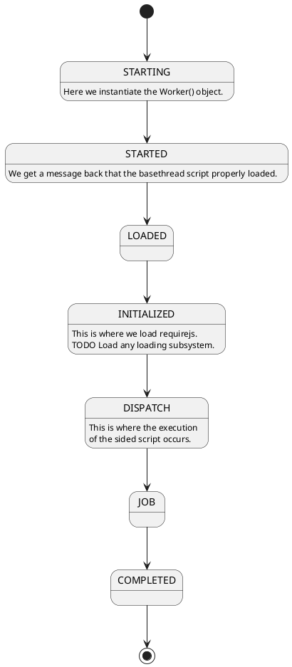

# WebJobs

## Links

+ [WebWorkers](https://developer.mozilla.org/en-US/docs/Web/API/Worker)


## Abstract

A web worker that runs small scripts with a certain interface and wraps the work in a promise.

The idea would be to figure out this mechanism and how to run tests in it as well then publish it.

So for some reason they named threads web workers in the browser so I have named this package webjobs.

So the idea is a library where you learn to kick small jobs to threading and then they notify you when it is done.

## Samples

```javascript
define('SomeProcessingModule',
  ['src/TroubleMaker'],
  function(TroubleMaker) {
    var jobPromise = TroubleMaker.start({
      jobPath: 'src/Addition',
      jobparams: {
        param1: 10,
        param2: 20
      }    
    });

    jobPromise.then(function(results) {
      console.log(results);
    }).catch(function(err) {
      console.error(err);
    });
  });
```

## TroubleMaker

At some point some night... I decided JobStarter and JobManager were too lame.
and I said who is going to start and thought TroubleMaker and the name stuck in my head.

the coolest thing is git made it easy to do this.

## Tasks

+ [x] Get basic tests running with client code running webworkers.


## Dispatching

The main key to managing a thread was devising a protocol to initialize, start, and complete work.

Each message is an int because I prefer int compares to string compares for efficiency.

```plantuml
Main->WebWorker : start
WebWorker->Main : SCRIPTLOADED
Main->WebWorker : BASEINIT
WebWorker->Main : BASEINIT_COMPLETE
WebWorker->Main : BASEINIT_ERROR
Main->WebWorker : DISPATCH
WebWorker->Main : DISPATCH_COMPLETE
WebWorker->Main : DISPATCH_ERROR
```

Some enums that matter

```plantuml
class MessagIds <<enumeration>> {
  SCRIPTLOADED: 0,
  BASEINIT: 1,
  BASEINIT_COMPLETE: 2,
  BASEINIT_ERROR: 3,
  DISPATCH: 4,
  DISPATCH_COMPLETE: 5,
  DISPATCH_ERROR: 6
}

class WorkerStates <<enumeration>> {
  STARTING: 0,
  STARTED: 1,
  LOADED: 2,
  INITIALIZED: 3,
  DISPATCH: 4,
  JOB: 5,
  COMPLETED: 6
}
```

And a state machine describing how a thread is managed.



## Status

6/09/2018

Got tests running...got requirejs laoding in test not in regular browser...
upon configure of requirejs...we cannot request the job maybe we need base/


Late ... the requirejs is configured and we supposdely succeed in loading Job script but it is NOT being called.  we cannot instantiate...

6/10/2018

SO if we give the full path to the job script the importScripts() call works and we get called back but the object is null because the define does not match the url...

Very difficult problem to solve...

10/3/2018

Got testsite doing its first job.
